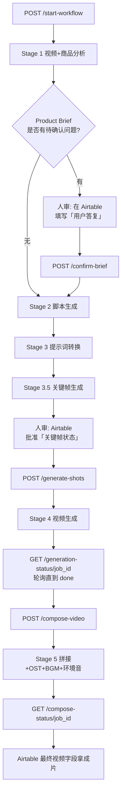

# Semantic Video Replication Workflow

> 一键式语义视频复刻工作流：基于一段产品视频和一份新商品资料，自动复刻出新商品的成片。

[](https://www.python.org/)
[](https://fastapi.tiangolo.com/)
[](LICENSE)

---

## 功能概览

将一支带货短视频「语义复刻」为一支新商品的同结构带货视频。系统理解原视频的节奏、镜头语言、动作序列，
然后用新商品的资料（图片、商详、3D 模型）重生成等价但合规的成片。

- **Stage 1 准备阶段**：商品理解（Product Brief Agent + 商详视频差分）、原视频节奏分析、视觉资产抠图与三视图生成
- **Stage 2 脚本生成**：基于原视频镜头脚本结构 + 新商品差异，重写脚本
- **Stage 3 提示词转换**：脚本 → 分镜级图像 / 视频 prompt（含审核）
- **Stage 3.5 关键帧生成**：图像编辑模型生成首/尾帧锚点（构图坍缩三层降级保护）
- **Stage 4 视频生成**：Seedance 主用 / Kling 首尾双锚定 / Wan 兜底
- **Stage 5 镜头合成**：FFmpeg 拼接 + OST/字幕叠加 + 镜头内环境音 + 可选 BGM

支持 **simple / full 双模式**：simple 模式跳过审核环节快速预览；full 模式启用全部审查模型保障质量。

---

## 快速开始

### 1. 环境要求
- Python **3.9 ~ 3.10**
- FFmpeg **≥ 4.0**（必需）：`brew install ffmpeg` / `apt install ffmpeg`
- Blender（可选，仅 3D 渲染脚本需要）

### 2. 安装

```bash
git clone <your-repo-url> video-replication-service
cd video-replication-service

python3 -m venv .venv
source .venv/bin/activate
pip install -r requirements.txt
```

### 3. 配置

```bash
cp .env.example .env
```

编辑 `.env`，**至少配置以下密钥**才能跑通主流程：

| 变量 | 用途 | 申请入口 |
|---|---|---|
| `GEMINI_API_KEY` | 视频/图像理解、Prompt 转换、审核 | https://aistudio.google.com/apikey |
| `QWEN_API_KEY` | 分镜提示词自审核 | https://bailian.console.aliyun.com/ |
| `SEEDANCE_API_KEY` | 主用图生视频平台 | https://console.volcengine.com/ark |
| `KLING_ACCESS_KEY` / `KLING_SECRET_KEY` | 首尾双锚定视频平台（可选） | https://klingai.com/dev-center |
| `AIRTABLE_API_KEY` / `AIRTABLE_BASE_ID` | 工作流状态存储 | https://airtable.com/create/tokens |
| `OSS_ACCESS_KEY_ID` / `OSS_ACCESS_KEY_SECRET` / `OSS_BUCKET_NAME` | 素材存储 | https://oss.console.aliyun.com |

可选：`TAVILY_API_KEY`（商品品牌检索）、`ELEVENLABS_API_KEY`（环境音）、`SUNO_API_KEY`（BGM）、`WAN_API_KEY`（兜底）。

> 完整变量列表与说明见 [.env.example](.env.example)。

### 4. 启动服务

```bash
uvicorn main:app --host 0.0.0.0 --port 8000 --reload
```

打开 http://localhost:8000/docs 查看 Swagger API 文档。

### 5. 跑一个最小用例（Demo）

准备一支已上传到 OSS（或任意可公开访问 HTTPS）的原视频 + 一张新商品图，最小化触发：

```bash
curl -X POST http://localhost:8000/api/v1/start-workflow \
  -H "Content-Type: application/json" \
  -d '{
    "project_id": "demo_001",
    "project_name": "快速入门Demo",
    "video_url": "https://your-bucket.oss-cn-beijing.aliyuncs.com/demo/original.mp4",
    "product_image_url": "https://your-bucket.oss-cn-beijing.aliyuncs.com/demo/product.jpg",
    "product_listing_url": "https://www.lazada.com.my/products/your-product-i123456.html",
    "mode": "simple"
  }'
```

返回示例：
```json
{"project_id": "recXXXXXXXXXXXXXX", "status": "started", "job_id": "job_abc123"}
```

**预期产出节奏**（simple 模式，单镜头 5s × 5 个镜头为例）：

| 阶段 | 耗时（约） | 看哪里 |
|---|---|---|
| Stage 1 视频/商品分析 | 1~3 分钟 | Airtable Project「Stage」=`ANALYZING` |
| Stage 2 脚本生成 | 30 秒 | Airtable Shots 表「新镜头描述」字段 |
| Stage 3 提示词 | 30 秒 | Shots「视频生成提示词」字段 |
| Stage 3.5 关键帧 | 2~5 分钟 | Shots「关键帧」字段（图片 URL） |
| **人审关键帧** | 取决于你 | Airtable 把「关键帧状态」改为「已通过」 |
| Stage 4 视频生成 | 3~8 分钟 | Shots「生成视频」字段 |
| Stage 5 合成 | 1~2 分钟 | Project「最终视频」字段（成片 URL）|

> 💡 第一次跑建议用 `simple` 模式跳过部分审核以快速验证链路；正式交付切 `full`。

---

## Airtable 配置

工作流以 Airtable 作为状态库与人审入口。需要在你的 Base 中创建以下表：

- **Projects**：项目主表（含原视频 URL、新商品资料、Stage 状态、模式开关等）
- **Assets**：素材表（产品图、抠图、三视图、关键帧、分镜视频等）
- **Shots**：分镜表（脚本、prompt、首尾帧引用、生成结果）

> Schema 详见后续 `docs/airtable-schema.md`（待补）。

---

## 项目结构

```
.
├── agents/              # Product Brief Agent / Clip Editor Agent
├── workflows/           # 5 个 Stage 的编排逻辑
├── services/            # 各 AI/云平台服务封装（gemini / kling / seedance / wan / oss / airtable / ffmpeg ...）
├── prompts/             # 所有 prompt 模板（按 stage / 任务分类）
├── models/              # Pydantic 数据模型
├── scripts/             # 通用运维工具（见 scripts/README.md）
├── assets/fonts/        # OST/字幕字体（OFL 协议）
├── main.py              # FastAPI 入口
├── config.py            # pydantic-settings 配置加载
└── .env.example         # 环境变量模板
```

---

## API 调用流程

工作流不是一键全自动 —— 中间有 **2 个人审卡点**（Product Brief 与 Keyframe），所以是「分阶段触发」模式。



### 接口清单

| 阶段 | 方法 + 路径 | 触发时机 |
|---|---|---|
| 启动 | `POST /api/v1/start-workflow` | 提交 video_url + product_image_url 启动 Stage 1 |
| 确认 Brief | `POST /api/v1/projects/{project_id}/confirm-brief` | 看到 Airtable 有待确认问题时填答案后调用 |
| 触发视频生成 | `POST /api/v1/generate-shots` | 关键帧人审通过后调用 |
| 查 Stage 4 进度 | `GET /api/v1/generation-status/{job_id}` | 轮询 |
| 触发合成 | `POST /api/v1/compose-video` | Stage 4 全部 done 后调用 |
| 查 Stage 5 进度 | `GET /api/v1/compose-status/{job_id}` | 轮询 |
| 查项目人审状态 | `GET /api/v1/project/{project_id}/review-status` | 任意时刻 |
| 健康检查 | `GET /health` | 启动后烟测 |

完整接口与参数见 http://localhost:8000/docs（Swagger UI）。

---

## 双模式

```python
# simple 模式：跳过部分审核，快速预览
POST /api/v1/projects/{id}/start  body: {"mode": "simple"}

# full 模式：启用全部审查模型，质量保障
POST /api/v1/projects/{id}/start  body: {"mode": "full"}
```

---

## 部署

推荐 Docker 部署（Dockerfile 待补）。注意：
- FFmpeg 必须在容器中可用
- `tmp/` 目录需要可写
- OSS Endpoint 与 Bucket 区域需一致
- 海外 API（Gemini/ElevenLabs/Tripo3D）若部署在国内服务器需配置代理

---

## 字体许可

`assets/fonts/` 中的字体均来自 [Google Fonts](https://fonts.google.com)，遵循 **SIL Open Font License (OFL) 1.1**：
- Anton — Vernon Adams
- Archivo Black — Omnibus-Type
- Oswald — Vernon Adams
- Poppins — Indian Type Foundry

---

## License

[MIT](LICENSE)

---

## 常见问题 FAQ

### Q1. 启动后 Stage 1 一直没动 / 报 Gemini 连接超时
**原因**：Gemini API 在国内需要走代理。
**解法**：在 `.env` 中配置 `HTTP_PROXY` 与 `HTTPS_PROXY`，例如：
```bash
HTTP_PROXY=socks5h://127.0.0.1:7890
HTTPS_PROXY=socks5h://127.0.0.1:7890
```

### Q2. Stage 4 某个 shot 在 Seedance 后台是 succeeded，但 Airtable 里却是 failed
**原因**：本地轮询遭遇 httpx 网络抖动，吞掉了 success 响应。
**解法**：参考 [.qoder/skills/incident-recovery/recipes.md](.qoder/skills/incident-recovery/recipes.md) 的 recipe-1：用 task_id 直接重拉 task 结果（48h 内有效）。

### Q3. Airtable 写「生成视频」字段报 422 `INVALID_ATTACHMENT_OBJECT`
**原因**：该字段是字符串 URL 类型，不是 attachment 数组。
**解法**：写入时传字符串 `{"生成视频": "https://..."}`，**不要**传 `[{"url": "..."}]`。

### Q4. 视频 URL 过期下载失败 / Kling URL 返回 403
- **过期**：OSS 签名 URL 默认 7 天有效，过期后用 `OSSService.get_signed_url()` 重签即可。
- **403**：Kling CDN 强校验 User-Agent，下载请求需要带 `User-Agent: Mozilla/5.0 ...` 头部。

### Q5. 关键帧画错了产品形态/构图（如按钮位置错、凭空多了人物）
**原因**：通常是 Stage 2 脚本改写时丢失了原视频的物理约束。
**解法**：使用 `visual-content-refinement` skill 的诊断决策树，定位是 Stage 2 还是 Stage 3 的问题，然后手工修正对应字段并重生关键帧。详见 [.qoder/skills/visual-content-refinement](.qoder/skills/visual-content-refinement)。

### Q6. 重跑 Stage 4 时 worker 跳过了所有 shot
**原因**：worker 检查到 Airtable「生成视频」字段非空就会跳过。
**解法**：先把所有 shot 的「生成视频」字段清空，然后再调 `/generate-shots`。可写一个 `reset_shots_for_restage4` 脚本，参考 incident-recovery skill 的 recipe-9。

### Q7. 镜头数量不符合预期（原视频 12 镜头，复刻只有 8 镜头）
**原因**：Gemini 视频分割结果不稳定，且 Stage 2 会做镜头合并。
**解法**：检查 Airtable Assets 表 `video_analysis` 字段；如需要严格保持原镜头数，在 Stage 2 prompt 中加约束（不推荐，会牺牲质量）。

### Q8. FFmpeg 报字体找不到 / OST 渲染乱码
**原因**：`assets/fonts/` 目录里字体文件丢失，或字体名拼写错误。
**解法**：确认 4 个字体文件存在（Anton/ArchivoBlack/Oswald/Poppins）；中文字幕需要额外提供中文字体，配置 `SUBTITLE_FONT` 环境变量。

### Q9. ElevenLabs 环境音 401 unauthorized
**原因**：API Key 缺少 `sound_effects` 权限。
**解法**：去 ElevenLabs Dashboard → API Keys → 编辑 → 勾选 `sound_effects` 权限。

### Q10. 想知道某个 shot 现在卡在哪里
```bash
curl http://localhost:8000/api/v1/project/recXXX/review-status
```
返回会告诉你当前 Stage、有没有待人审、各 shot 的状态。

> 更多事故应对见 `incident-recovery` skill；视觉质量调整见 `visual-content-refinement` skill。

---

## 安全声明

- **永远不要**将 `.env` 文件提交到版本控制
- 所有外部 API Key 都应该走 RAM 子账号 / 最小权限原则（尤其是 OSS 与 ElevenLabs）
- 生产部署建议使用密钥管理服务（KMS / Secrets Manager）替代 `.env`
